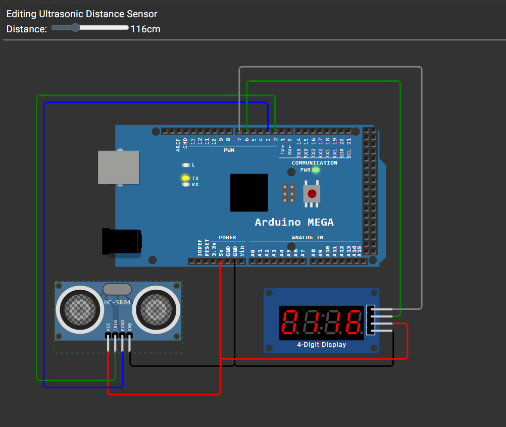

# Arduino Mega + HC-SR04 + TM1637 4‑Digit Display



This repository contains firmware and helper files to read distance from an HC-SR04 ultrasonic sensor using an Arduino Mega (ATmega2560) and display the measured distance on a TM1637 4‑digit display. The firmware prints debug information to UART (9600 baud) to help calibration and troubleshooting.

Contents
- `main.c` — firmware: HC‑SR04 measurement using Timer1, TM1637 driver, UART debug output.
- `diag_7seg.c` — small diagnostic firmware for mapping a raw 4‑digit common‑cathode display.
- `build.ps1` / `build_diag.ps1` — PowerShell scripts to compile firmware into `main.hex` / `diag_7seg.hex` using `avr-gcc` and `avr-objcopy`.
- `diagram.json`, `wokwi.toml` — Wokwi simulator project files matching the example wiring.


Quick Summary
- Triggers the HC‑SR04 and measures the echo pulse length using hardware Timer1 (prescaler = 8) for accurate timing.
- Displays distance on a TM1637 4‑digit module and prints raw timing and calculated distance to UART.
- Includes a diagnostic program for bare 4‑digit displays and helper build scripts.

Wiring (example used in this project)
- HC‑SR04 VCC -> `5V`
- HC‑SR04 GND -> `GND`
- HC‑SR04 TRIG -> `D2` (PORTE `PE4`)
- HC‑SR04 ECHO -> `D3` (PORTE `PE5`)
- TM1637 DIO -> `D6` (PORTH `PH3`)
- TM1637 CLK -> `D7` (PORTH `PH4`)
- TM1637 VCC -> `5V`
- TM1637 GND -> `GND`

Note: If you use a bare 4‑digit common‑cathode display instead of a TM1637 module, use `diag_7seg.c` to identify segment wiring and update `main.c` accordingly.

Build (Windows PowerShell)
1. Install an AVR toolchain (e.g. WinAVR or avr‑gcc) and ensure `avr-gcc` and `avr-objcopy` are on your `PATH`.
2. From the project folder run:

```powershell
.\build.ps1
```

This produces `main.hex`.

To build the diagnostic program:

```powershell
.\build_diag.ps1
```

Flash
Use your preferred uploader. Example using `avrdude` (adjust COM port and programmer):

```powershell
avrdude -p m2560 -c wiring -P COM3 -b 115200 -U main.hex
```

Run & Test
- Open a serial monitor at `9600` baud (8N1). Expected debug lines include:
  - `Raw ticks: <n>` (Timer1 ticks, prescaler=8 -> tick = 0.5 µs)
  - `Us (approx): <n>` (approximate microseconds)
  - `Distance: <n> cm`
- The TM1637 display should show the measured distance.

Calibration & Troubleshooting
- If measurements are consistently offset by a small fixed amount, set `CALIB_OFFSET_CM` in `main.c` (positive to increase reported distance).

- If the TM1637 display is blank:
  - Verify `DIO->D6` and `CLK->D7` wiring, VCC and GND.
  - External pull-ups (~10k) on DIO/CLK may improve reliability.
- For a raw 4‑digit display: run the `diag_7seg` firmware to determine segment mapping and digit polarity.

Simulator (Wokwi)
- The repository includes `diagram.json` and `wokwi.toml`. The included `image.png` shows the simulator wiring. In Wokwi the project points to `main.hex` so you can simulate the entire setup in the browser.

Further improvements (already possible)
- Non-blocking display refresh via a Timer ISR (reduces blocking during measurement).
- Median filtering or averaging to smooth noisy measurements (can be enabled in firmware).

License
- This repository is provided as-is for learning and prototyping. You can reuse and adapt the code for your projects.

----
This README describes the firmware and how to build, flash and test it; no interactive choices are required here.


